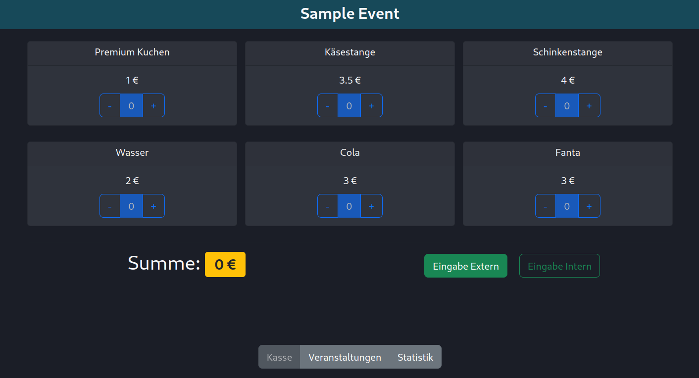

# CheckoutSystem
This is a cross-platform application written with Angular and Electron. It provides a nice user interface for a checkout system usable for managing small events. The "database" consists of json files written to the application directory. Right now the application is only developed for the german language.

The system has 3 Tabs:

## Checkout

This tab is for taking customers orders, calculating the price and saving the sold items to the database. There is a distinction between "intern" (for people not paying at the event) and "extern" (paying customers). Only "extern" is used for calculating the revenue.

## Event Management

This Tab is for managing the event: Creating new ones, changing icons, and so on. Additionally, in this tab the current event is set. The current event is the one displayed in the Checkout tab.

